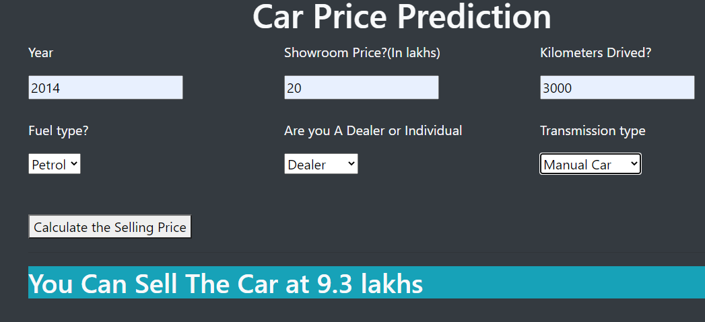
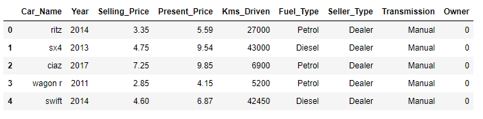

<h2>Car Price Prediction 🚗</h2>
<h4>Table of Content
<h5><ul>
<li><a href="#demo">Demo</a></li>
<li><a href="#intro">Introduction</a></li>
<li><a href="#technical">Technical Aspects</a></li>
<li><a href ="#installation">Installation</a></li>
<li><a href="#">Model Creation</a></li>
<li><a href="#">Flask App Creation</a></li>
<li><a href="#">Deployment</a></li>
<li><a href="#">Conclusion and Further Development</a></li>
<li><a href="#">Technologies Used</a></li>
<li><a href="#">Credits</a></li>
</ul>
<h3 id="demo">Demo</h2>

Please Click <a href="https://carpricespredictionml.herokuapp.com/"> Here</a> to run the app</h3>
<h3 id="intro">Introduction</h3>

This is a machine learning based app to predict the price of used Car.

The model of the app is based on <b>Random Forest Regressor</b> which is famous for its high accuracy. Basically it is an ensemble learning technique which takes some "n" base learners mainly <b>Decision Trees</b> and take best prediction based on votes

<h4>Dataset used:</h4>

I have used <a href="https://www.kaggle.com/nehalbirla/vehicle-dataset-from-cardekho">Car Dekho</a> Data from <a href='https://www.kaggle.com/'>Kaggle</a>.

Here is dataset snippet

<h4>Motivation:</h4>

I created this app mainly for for the self learning purpose to make myself better in creating and building Machine Learning Model. One day I browse the Kaggle website and found this dataset and on that day I started analyzing this dataset and decided to make a prediction app based on this dataset.

<h3 id='technical'>Technical Aspects</h3>

This project is basically divided on 2 part

<ol>
<li>Model Building (using Random Forest and other machine learning algorithms) </li>
<li>Model Deployment using Flask in Heroku Platform
</ol>
<h3 id="installation">Installation</h3>
<h4>Python Installation</h4>

I worked in Anaconda Platform in this project, you can visit <a href='https://www.anaconda.com/products/individual'>this website</a> to download anconda's individual edition

Please make a saparate enviroment before jumping into code
 
