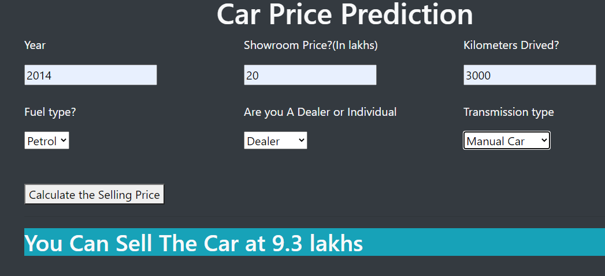
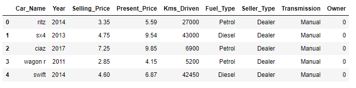
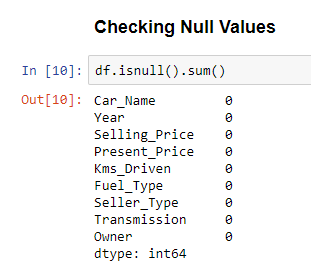
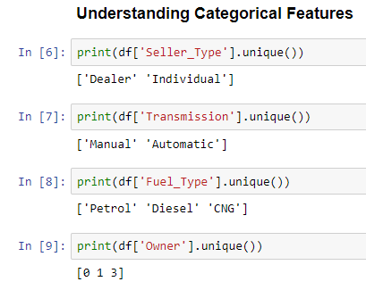
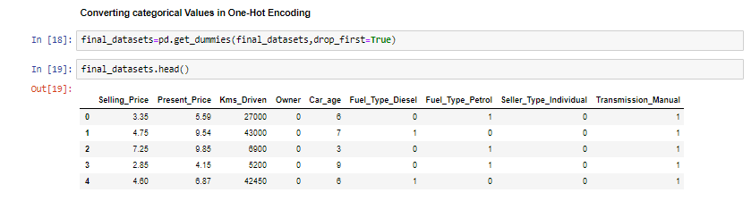
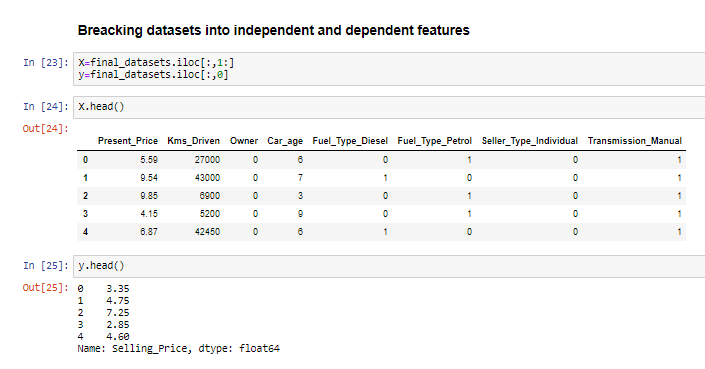
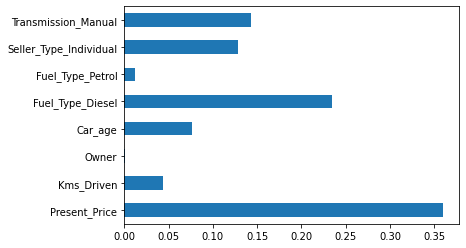
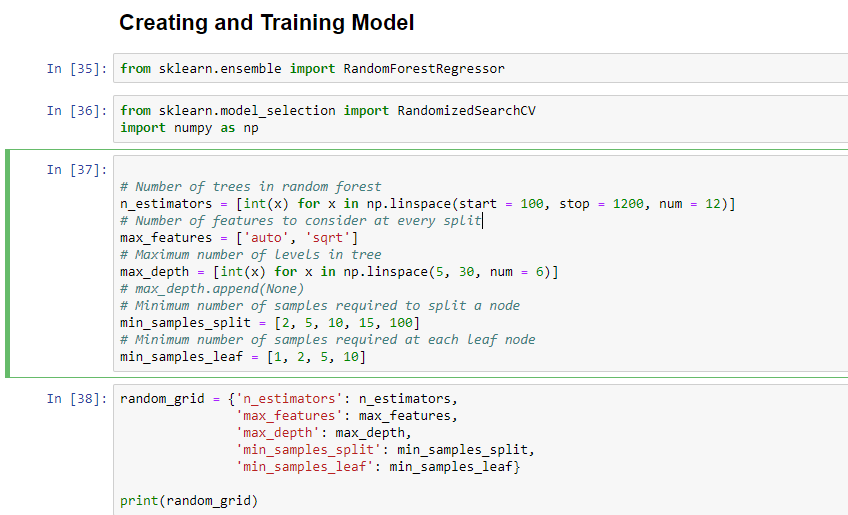
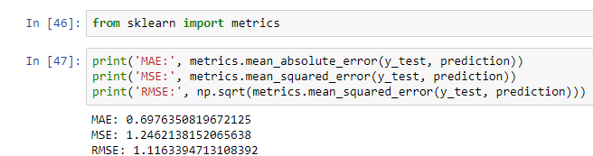
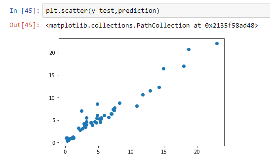

<h2>Car Price Prediction 🚗</h2>
<h4>Table of Content
<ul>
<li><a href="#demo">Demo</a></li>
<li><a href="#intro">Introduction</a></li>
<li><a href="#technical">Technical Aspects</a></li>
<li><a href ="#installation">Installation</a></li>
<li><a href="#model">Model Creation</a></li>
<li><a href="#flaskapp">Flask App Creation</a></li>
<li><a href="#deployment">Deployment</a></li>
<li><a href="#cfd">Conclusion and Further Development</a></li>
<li><a href="#technologyused">Technologies Used</a></li>
<li><a href="#credits">Credits</a></li>
</ul>
<h3 id="demo">Demo</h2>

Please Click <a href="https://carpricespredictionml.herokuapp.com/"> Here</a> to run the app</h3>
<h3 id="intro">Introduction</h3>

This is a machine learning based app to predict the price of used Car.

The model of the app is based on <b>Random Forest Regressor</b> which is famous for its high accuracy. Basically it is an ensemble learning technique which takes some "n" base learners mainly <b>Decision Trees</b> and take best prediction based on votes

<h4>Dataset used:</h4>

I have used <a href="https://www.kaggle.com/nehalbirla/vehicle-dataset-from-cardekho">Car Dekho</a> Data from <a href='https://www.kaggle.com/'>Kaggle</a>.

<h4>Understanding Data:</h4>

Here is dataset snippet

Dataset consist of various columns such as <i>Car_name</i>,<i>year</i>,<i>Selling_Price</i>,<i>Present_price</i> etc.

On the basis of this dataset we need to decide what should be the price of any second hand car. This is a regression task i.e. we need to predict continuous value from the data therefore we need to go with those algorithms which is good with this.
 

<h3 id='technical'>Technical Aspects</h3>

This project is basically divided on 2 part

<ol>
<li>Model Building (using Random Forest and other machine learning algorithms) </li>
<li>Model Deployment using Flask in Heroku Platform
</ol>
<h3 id="installation">Installation</h3>
<h4>Python Installation</h4>

I worked in Anaconda Platform which you can visit by clicking <a href='https://www.anaconda.com/products/individual'>this website</a> to download anconda's individual edition

Please make a saparate enviroment before jumping into code
 

Please install all the following pakages using <i>"pip install"</i>
<ul><li>sklearn</li><li>pandas</li><li>numpy</li><li>flask</li><li>matplotlib</li><li>seaborn</li><li>jsonify</li><li>requests</li></ul>

<h3 id="model">Model Creation</h3>

Before training our model we need to clean and analyze our dataset. Let's see how we did it

<h4>Data Cleaning and EDA</h4>

I first decided to check null values in the dataset.

So it's great! that we don't have any null values present in it.

Next let's check frequency of the cateogrical features in the dataset.

So According to the above figure we have to convert <i>Seller_Type</i>,<i>Transmission</i> and <i>Fuel Type</i> into one hot vector so that we can perform numerical calculations on them

Next we need to break the data into <b>Independet</b> and <b>Dependent</b> feature.

Since we are using Tree based learning algorithm so we do NOT required <b>Feature Engineering</b> or <b>Feature Scaling</b>. But if anyone want to work with any other algo they must need to first convert the features into its scalled form and then train the model.

Let's check the important feature in the dataset.

So clearly it shows that <i>"Owner"</i> feature not at all important for our model training so we decided to remove it from the training data. As it only increases the size without giving any value.

Now after doing all Data Analysis we are going for training our model. Let's split our data into train and test set.

Note that we are using RandomizedSearchCV for Hyperparameter Tuning, and because of this model get a good accuracy.

Let's See the accuracy of our Model

Let's see the scatter plot between prediction and real value

so it looks fine and prediction should be accuratly capture as the regression line is following the plotted points

Hence our model is trained

<h3 id='flaskapp'>Flask App Creation</h3>

First we need to create the HTML file in a templetes folder for our flask's app.py file; as it detect all the html files from that folder itself.

You can check my template folder for that file.

Then we need to create a flask app which capture all the inputs from the user and then preprocess all the data collected from the user and then give the data to the model for making prediction

You can check my <b>app.py</b> file for the code.

<h3 id='deployment'>Deployment</h3>

We are using Heroku app for deploying our flask app.

<b>Note that we need procfile, requriments.txt and runtime.txt file before proceeding for the deployment.</b>

<b>procfile</b> contain gunicorn code which  is a Python Web Server Gateway Interface HTTP server. That is used to pass our python code to http server.

<b>requriments.txt</b> is a text file containing all our packages name that we used in this project

We also require <b>runtime.txt</b> file which is basically tell heroku server to download specific python version on the server which is given in the text file

After all these formalities we are ready to deploy our model just visit Heroku website and create this app 

<h3 id='cfd'>Conclusion and Further Devlopment</h3>

After creating this model which seems to give good accuracy on new data and working without much problem

But following are the points that we can used to further developed the product

<ul>
<li>Firstly it's not available offline where we might work in future (By using some advance cloud services).</li>
<li>
<li>We may improve the accuracy when we get the new data</li>
</ul>

Note that if anyone want to suggest me anything please ping me on linkedIn. It's very helpful for me

<h3 id='technologyused'>Technologies Used</h3>

&nbsp;&nbsp;
&nbsp;&nbsp;
&nbsp;&nbsp;
&nbsp;&nbsp;
&nbsp;&nbsp;
&nbsp; &nbsp;
&nbsp; &nbsp;

<h3 id='credits'>Credits</h3>

As I am a self learner my special thanks goes to <a href='https://www.youtube.com/channel/UCNU_lfiiWBdtULKOw6X0Dig'>Krish Naik</a> sir. He is a brilliant teacher, data scientist and auther.

I also thanks to Andrew Ng sir. He also help me a lot to learn the fundamental mathamatics behind the machine learning algorithms 
 

